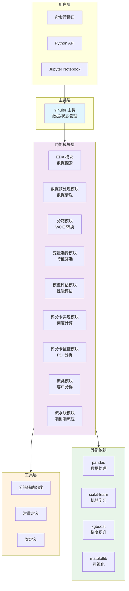

# 系统架构

Yihuier 采用面向对象的模块化架构，将评分卡建模的各个步骤封装为独立的模块类，通过主类统一管理数据和状态。

## 设计理念

### 核心原则

1. **单一职责**：每个模块类只负责一个功能领域
2. **高内聚低耦合**：模块内部高度相关，模块间依赖最小化
3. **状态管理**：数据和状态封装在类中，避免参数传递
4. **易于扩展**：便于添加新功能和新方法

### 架构优势

**传统函数式编程**：
```python
# 需要重复传递参数
bin_df, iv = binning_cate(df, col_list, target)
woe_df = woe_transform(df, bin_df, col_list, target)
score_df = score_transform(df, woe_df, model, target)
```

**Yihuier 面向对象**：
```python
# 一次初始化，到处使用
yh = Yihuier(data, target='dlq_flag')
bin_df, iv = yh.binning_module.binning_cate(col_list)
woe_df = yh.binning_module.woe_transform()
score_df = yh.si_module.score_transform(model)
```

## 系统架构图



## 模块设计

### 主类：Yihuier

**职责**：
- 管理输入数据和目标变量
- 初始化所有功能模块
- 提供统一的数据访问接口
- 协调模块间的交互

**关键属性**：
```python
class Yihuier:
    data: pd.DataFrame              # 数据集
    target: str                      # 目标变量名

    # 功能模块
    eda_module: EDAModule
    dp_module: DataProcessingModule
    binning_module: BinningModule
    var_select_module: VarSelectModule
    me_module: ModelEvaluationModule
    si_module: ScorecardImplementModule
    sm_module: ScorecardMonitorModule
    cluster_module: ClusterModule
    pipeline_module: PipelineModule
```

**关键方法**：
```python
def get_numeric_variables() -> List[str]
def get_categorical_variables() -> List[str]
def get_date_variables() -> List[str]
```

### EDA 模块

**职责**：数据探索性分析

**主要功能**：
- 自动化 EDA 报告
- 数值型变量分布可视化
- 类别型变量分布可视化
- 违约率分析

**数据流**：
```
Yihuier.data → EDAModule.data → 可视化输出
```

### 数据预处理模块

**职责**：数据清洗和预处理

**主要功能**：
- 缺失值处理
- 常变量删除
- 异常值处理
- 目标变量缺失删除

**数据流**：
```
Yihuier.data → DataProcessingModule → 清洗后数据
```

### 分箱模块

**职责**：变量分箱和 WOE 转换

**主要功能**：
- 数值型变量分箱（ChiMerge、等频、等距、单调）
- 类别型变量分箱
- WOE 转换
- IV 值计算

**状态管理**：
```python
class BinningModule:
    bin_df: List[pd.DataFrame]      # 分箱结果
    iv_df: pd.DataFrame              # IV 值明细
    woe_result_df: pd.DataFrame      # WOE 结果表
    data_woe: pd.DataFrame           # WOE 转换后的数据
```

**数据流**：
```
原始数据 → 分箱 → WOE 转换 → WOE 数据
         ↓
      IV 计算
```

### 变量选择模块

**职责**：特征选择和降维

**主要功能**：
- XGBoost 特征重要性
- 随机森林特征重要性
- 相关性分析
- IV 筛选

**策略**：
```python
# 策略 1：直接基于重要性
xg_imp, _, xg_cols = select_xgboost(col_list, imp_num)

# 策略 2：IV + 相关性去重
final_vars = forward_delete_corr_ivfirst(col_list, threshold)
```

### 模型评估模块

**职责**：模型性能评估

**主要功能**：
- ROC 曲线
- KS 曲线
- 学习曲线
- 交叉验证
- 混淆矩阵

**与 sklearn 集成**：
```python
# sklearn 模型训练
model = LogisticRegression()
model.fit(X_train, y_train)

# Yihuier 评估
yh.me_module.plot_roc(y_test, y_pred)
yh.me_module.plot_model_ks(y_test, y_pred)
```

### 评分卡实现模块

**职责**：评分卡刻度和分数转换

**主要功能**：
- 刻度参数计算（A, B, base_score）
- 变量得分表生成
- 分数转换
- Cutoff 验证

**数学公式**：
```
Score = A - B × ln(odds)
       = A - B × (β₀ + β₁WOE₁ + ... + βₙWOEₙ)
```

### 评分卡监控模块

**职责**：模型稳定性监控

**主要功能**：
- PSI 计算
- 分数分布对比
- 变量稳定性分析
- 变量偏移检测

**监控流程**：
```
训练样本分布 vs 上线样本分布
         ↓
      PSI 计算
         ↓
    稳定性判断
```

### 聚类模块

**职责**：客户聚类分析

**主要功能**：
- K-Means 聚类
- DBSCAN 聚类
- 层次聚类
- 聚类可视化

### 流水线模块

**职责**：端到端建模流程

**主要功能**：
- 完整建模流程封装
- 自动化参数调优
- 结果汇总和报告

## 数据流设计

### 完整建模流程


### 模块间数据共享

```python
# 主类管理数据
yh = Yihuier(data, target='dlq_flag')

# 模块间通过主类共享数据
yh.dp_module.fillna_num_var(vars)  # 修改 yh.data
yh.binning_module.binning_num(vars)  # 读取 yh.data
yh.binning_module.woe_transform()  # 生成 yh.binning_module.data_woe

# 变量选择模块使用 WOE 数据
yh.var_select_module.select_xgboost(
    yh.binning_module.data_woe.columns
)
```

## 扩展性设计

### 添加新模块

**步骤**：

1. **创建模块类**：
```python
# yihuier/new_module.py
class NewModule:
    def __init__(self, yihuier_instance):
        self.yihuier_instance = yihuier_instance
        self.data = self.yihuier_instance.data.copy()

    def new_function(self):
        # 实现新功能
        pass
```

2. **在主类中注册**：
```python
# yihuier/yihuier.py
from .new_module import NewModule

class Yihuier:
    def __init__(self, data, target):
        # ...
        self.new_module = NewModule(self)
```

### 添加新分箱方法

```python
# 在 BinningModule 中添加
def binning_num_new_method(self, col_list, **kwargs):
    """新的分箱方法"""
    for col in col_list:
        # 实现新分箱逻辑
        pass
```

### 添加新评估指标

```python
# 在 ModelEvaluationModule 中添加
def custom_metric(self, y_label, y_pred):
    """自定义评估指标"""
    # 实现新指标逻辑
    pass
```

## 性能优化

### 向量化计算

Yihuier 大量使用 pandas 和 numpy 的向量化操作：

```python
# 向量化 WOE 计算
data_woe = data.copy()
for col in col_list:
    mapping = woe_dict[col]
    data_woe[col] = data[col].map(mapping)

# 而非循环
for idx, row in data.iterrows():
    for col in col_list:
        data_woe.loc[idx, col] = woe_dict[col][row[col]]
```

### 内存优化

```python
# 使用 copy() 控制内存
self.data = self.yihuier_instance.data.copy()

# 及时删除不需要的数据
del temp_df
import gc
gc.collect()
```

### 并行处理

```python
# 对独立变量使用并行处理
from multiprocessing import Pool

def process_variable(col):
    # 处理单个变量
    pass

with Pool(processes=4) as pool:
    results = pool.map(process_variable, col_list)
```

## 类型提示

Yihuier 使用完整的类型提示：

```python
from typing import List, Tuple, Optional, Union
import pandas as pd
import numpy as np

class BinningModule:
    def binning_num(
        self,
        col_list: List[str],
        max_bin: Optional[int] = None,
        min_binpct: Optional[float] = None,
        method: str = 'ChiMerge'
    ) -> Tuple[List[pd.DataFrame], List[float]]:
        """
        数值型变量分箱

        Args:
            col_list: 变量列表
            max_bin: 最大分箱数
            min_binpct: 最小分箱占比
            method: 分箱方法

        Returns:
            (分箱结果列表, IV 值列表)
        """
        pass
```

## 测试策略

### 单元测试

每个模块都有独立的单元测试：

```python
# tests/test_binning.py
def test_binning_num():
    yh = Yihuier(sample_data, target='dlq_flag')
    bin_df, iv_value = yh.binning_module.binning_num(
        col_list=['v1', 'v2'],
        max_bin=5
    )
    assert len(bin_df) == 2
    assert len(iv_value) == 2
```

### 集成测试

测试完整的建模流程：

```python
# tests/test_integration.py
def test_full_pipeline():
    yh = Yihuier(sample_data, target='dlq_flag')
    # 完整建模流程
    # ...
    assert auc > 0.6
```

## 参考资源

- [贡献指南](contributing.md) - 如何贡献代码
- [更新日志](changelog.md) - 版本更新记录
