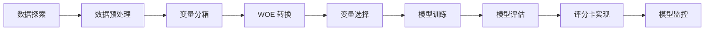

# 功能模块

Yihuier 包含 9 个功能模块，覆盖评分卡建模的完整流程。

## 模块列表

### 数据处理模块

- [EDA 模块](eda.md) - 数据探索性分析
- [数据预处理模块](data-processing.md) - 数据清洗和预处理

### 建模核心模块

- [分箱模块](binning.md) - 变量分箱和 WOE 转换
- [变量选择模块](var-select.md) - 特征选择和降维

### 模型相关模块

- [模型评估模块](model-evaluation.md) - 模型性能评估
- [评分卡实现模块](scorecard-implement.md) - 评分卡刻度和分数转换
- [评分卡监控模块](scorecard-monitor.md) - 模型监控和 PSI 分析

### 扩展模块

- [聚类模块](cluster.md) - 客户聚类分析
- [流水线模块](pipeline.md) - 端到端建模流程

## 使用流程

典型的评分卡建模流程：

## 快速导航

- 📖 **初学者**: 从 [EDA 模块](eda.md) 开始
- 🔧 **实践者**: 查看 [分箱模块](binning.md) 和 [变量选择模块](var-select.md)
- 📊 **建模者**: 阅读 [模型评估模块](model-evaluation.md) 和 [评分卡实现模块](scorecard-implement.md)
- 🔍 **监控**: 了解 [评分卡监控模块](scorecard-monitor.md)

---

**下一步**: [EDA 模块](eda.md) 或查看 [API 文档](../api.md)
