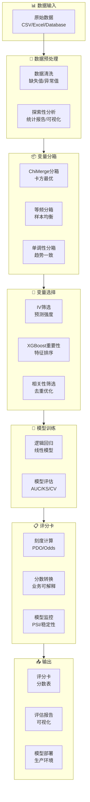

# 快速开始指南

欢迎使用 Yihuier（一会儿），这是一个专业的信用评分卡建模 Python 工具包。本指南将帮助你在几分钟内上手，完成从数据加载到评分卡部署的完整流程。

## 系统架构



::: tip 推荐学习路径
1. 先熟悉基础概念（WOE、IV、PSI等）
2. 运行快速开始示例，理解完整流程
3. 阅读各模块文档，掌握详细用法
4. 参考高级示例，学习最佳实践
:::

## 环境要求

- Python 3.13+
- pandas >= 2.1.4
- numpy >= 1.26.0
- scikit-learn >= 1.3.2
- xgboost >= 2.0.3
- matplotlib >= 3.8.2
- seaborn >= 0.12.2

## 快速安装

### 步骤一：安装 Yihuier

```bash
# 使用 uv 安装（推荐）
uv pip install yihuier

# 或使用 pip
pip install yihuier
```

如果没有安装 `uv`，可以先安装：

```bash
# macOS/Linux
curl -LsSf https://astral.sh/uv/install.sh | sh

# Windows
powershell -c "irm https://astral.sh/uv/install.ps1 | iex"
```

### 步骤二：准备数据

确保你的数据包含以下要素：

- **目标变量**：二分类标签（0/1 或 False/True）
- **特征变量**：数值型或类别型特征
- **样本量**：建议至少 1000 条样本

```python
import pandas as pd

# 数据示例
data = pd.read_csv('your_data.csv')

# 必需要素检查
print(f"数据形状: {data.shape}")
print(f"目标变量分布:\n{data['target'].value_counts()}")
print(f"缺失值统计:\n{data.isnull().sum()}")
```

### 步骤三：快速建模

```python
from yihuier import Yihuier

# 1. 初始化
yh = Yihuier(data, target='dlq_flag')

# 2. 数据探索
eda_stats = yh.eda_module.auto_eda_simple()
print(f"数据质量报告:\n{eda_stats}")

# 3. 数据预处理
numeric_vars = yh.get_numeric_variables()
yh.data = yh.dp_module.fillna_num_var(numeric_vars, fill_type='0')
yh.data = yh.dp_module.target_missing_delete()

# 4. 变量分箱（使用前 5 个变量演示）
binning_vars = numeric_vars[:5]
bin_df, iv_value = yh.binning_module.binning_num(
    col_list=binning_vars, 
    max_bin=5, 
    method='ChiMerge'
)

# 5. WOE 转换
data_woe = yh.binning_module.woe_transform()

# 6. 变量选择
feature_cols = [col for col in data_woe.columns if col != yh.target]
xg_imp, _, xg_cols = yh.var_select_module.select_xgboost(
    col_list=feature_cols, 
    imp_num=10
)

# 7. 模型训练
from sklearn.linear_model import LogisticRegression
from sklearn.model_selection import train_test_split

X = data_woe[xg_cols]
y = data_woe[yh.target]

X_train, X_test, y_train, y_test = train_test_split(
    X, y, test_size=0.3, random_state=42, stratify=y
)

model = LogisticRegression(max_iter=1000)
model.fit(X_train, y_train)

# 8. 模型评估
y_pred = model.predict_proba(X_test)[:, 1]
yh.me_module.plot_roc(y_test, y_pred)
yh.me_module.plot_model_ks(y_test, y_pred)

ks_value = yh.me_module.model_ks(y_test, y_pred)
print(f"KS 值: {ks_value:.4f}")

# 9. 评分卡实现
A, B, base_score = yh.si_module.cal_scale(
    score=600, odds=50, PDO=20, model=model
)

# 计算分数
test_scores = base_score + X_test.dot(model.coef_[0]) * B
print(f"基础分: {base_score:.2f}")
print(f"分数范围: {test_scores.min():.2f} - {test_scores.max():.2f}")
```

## 完整示例

我们提供了两个完整的示例：

### 基础使用示例

```bash
# 运行基础示例
python examples/basic_usage.py
```

基础示例涵盖：
- 数据加载和探索
- 数据预处理
- 变量分箱
- WOE 转换
- 变量选择

### 高级流程示例

```bash
# 运行完整建模流程
python examples/advanced_pipeline.py
```

高级示例涵盖：
- 完整的 10 步建模流程
- 多种变量选择策略
- 模型评估和验证
- 评分卡实现和监控
- 模型部署建议

## 运行测试

验证安装是否成功：

```bash
# 运行所有测试
pytest tests/ -v

# 查看测试覆盖率
pytest tests/ --cov=yihuier --cov-report=html
```

## 常见问题

### 数据格式要求

<details>
<summary><strong>我的数据在 Excel 中，如何使用？</strong></summary>

```python
# 读取 Excel 文件
import pandas as pd

data = pd.read_excel('your_data.xlsx', sheet_name='Sheet1')

# 确保目标变量是二分类
data['target'] = data['target'].astype(int)

# 继续使用 Yihuier
yh = Yihuier(data, target='target')
```

</details>

### 缺失值处理

<details>
<summary><strong>如何处理缺失值？</strong></summary>

```python
# 数值型变量填充
yh.data = yh.dp_module.fillna_num_var(
    numeric_vars, 
    fill_type='0'  # '0'=0, 'mean'=均值, 'median'=中位数, 'class'=特殊类别
)

# 类别型变量填充
yh.data = yh.dp_module.fillna_cate_var(
    categorical_vars, 
    fill_type='mode'  # 'mode'=众数, 'class'=特殊类别
)

# 删除高缺失率变量
yh.data = yh.dp_module.delete_missing_var(threshold=0.2)
```

</details>

### 分箱方法选择

<details>
<summary><strong>应该选择哪种分箱方法？</strong></summary>

| 分箱方法 | 适用场景 | 优点 | 缺点 |
|---------|---------|------|------|
| ChiMerge | 预测能力强 | 最优分箱，区分度高 | 计算慢，可能过拟合 |
| 等频分箱 | 样本量大 | 计算快，样本均衡 | 可能打破单调性 |
| 等距分箱 | 数据分布均匀 | 简单直观 | 对异常值敏感 |
| 单调性分箱 | 需要单调趋势 | 满足单调性要求 | 可能损失信息 |

推荐：默认使用 ChiMerge，如果计算太慢则使用等频分箱。

</details>

### 模型性能不佳

<details>
<summary><strong>模型 AUC/KS 不理想怎么办？</strong></summary>

1. **检查数据质量**：缺失值、异常值、目标变量分布
2. **增加特征**：派生特征、交叉特征
3. **调整分箱**：增加/减少分箱数、尝试不同方法
4. **变量选择**：尝试不同的变量选择策略
5. **模型调参**：调整正则化参数、solver 类型

```python
# 尝试不同的分箱数
for max_bin in [3, 5, 7, 10]:
    bin_df, iv_value = yh.binning_module.binning_num(
        col_list=vars, 
        max_bin=max_bin
    )
    print(f"max_bin={max_bin}, 平均IV={sum(iv_value)/len(iv_value):.4f}")
```

</details>

### 评分卡刻度调整

<details>
<summary><strong>如何调整评分卡刻度？</strong></summary>

```python
# 传统评分卡刻度
A, B, base_score = yh.si_module.cal_scale(
    score=600,      # 指定 odds 时的分数
    odds=50,        # 好坏比 50:1
    PDO=20,         # odds 翻倍时分数减少 20 分
    model=model
)

# 简化版公式
# B = PDO / ln(2)
# A = score - B * ln(odds)
```

常见的评分卡设置：
- **600 分对应 50:1 odds**（传统银行）
- **PDO = 20**（翻倍时减少 20 分）
- **基础分通常在 300-800 分之间**

</details>

## 下一步

- 查看 [模块文档](/guide/modules)：了解各模块的详细用法
- 阅读 [API 文档](/guide/api)：查看完整的 API 参考
- 浏览 [示例集合](/guide/examples)：学习更多实战案例
- 了解 [架构设计](/develop/architecture)：深入了解系统架构
